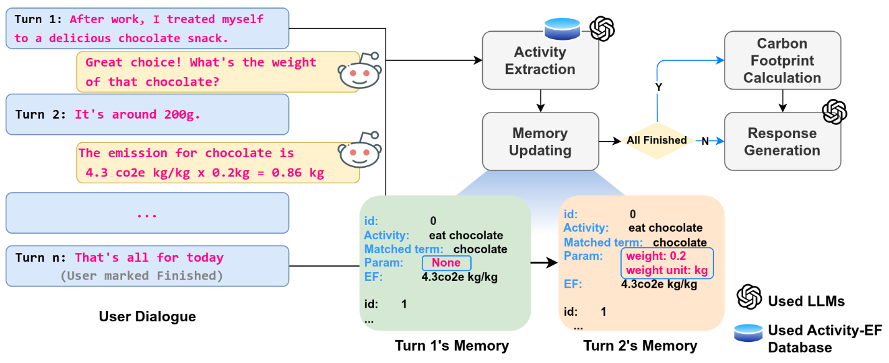

# CarbonDialog-1K: LLM-Driven Personal Carbon Footprint Estimation

## 📄 Introduction

This repository contains the **CarbonDialog-1K** dataset and the implementation of the **PCCT (Progressive Contextual Carbon Tracking)** framework. This work aims to estimate **Personal Carbon Footprint (PCF)** from natural language dialogues. PCF estimation is crucial for raising environmental awareness, but existing tools often suffer from fragmented scenarios and labor-intensive manual data entry.

This project utilizes **Large Language Models (LLMs)** to automate the extraction of activity parameters and calculation of emissions from casual conversation.

## 📊 The CarbonDialog-1K Dataset

To facilitate research in this domain, we constructed **CarbonDialog-1K**, a benchmark dataset comprising **1,028 annotated multi-turn dialogues**.

### Dataset Statistics
- **Total Dialogues**: 1,028
- **Regions Covered**: New Zealand, UK, Germany, China, US, France, and Global
- **Categories**: Transportation, Energy, Food & Beverages, Consumer Goods, Services, and Entertainment

### Data Structure Example
Below is a sample entry from the dataset representing a single user session. The data includes the dialogue history, structured ground-truth activities, specific emission factors used, and the final calculation.

```json
{
    "region": "NZ",
    "activities": [
        {
            "activity_id": "consumer_goods-type_ice_cream_and_edible_ices",
            "term": "cream",
            "category": "food",
            "parameters": {
                "money": 5,
                "money_unit": "nzd"
            },
            "time": "8:00-8:30",
            "narrative": "Started the day with a quick breakfast",
            "narrative_detail": "I stopped by a cafe on the way to work and grabbed a coffee and a cream-filled pastry for $5.",
            "unit_type": "Money",
            "unit": "kg/nzd",
            "carbon_footprint": {
                "co2e": 5.612,
                "co2e_unit": "kg",
                "emission_factor": 1.1224,
                "emission_factor_unit": "kg/nzd"
            }
        }
        // ... additional activities ...
    ],
    "dialogue": "User: Hi, I'd like to know my carbon footprint for today's activities.\nHelper: Hello!...",
    "carbon_footprint": {
        "total": 63.96647,
        "details": [
            {
                "term": "cream",
                "co2e": 5.612,
                "unit": "kg",
                "parameters": {
                    "money": 5,
                    "money_unit": "nzd"
                },
                "emission_factor": 1.1224,
                "emission_factor_unit": "kg/nzd",
                "activity_id": "consumer_goods-type_ice_cream_and_edible_ices"
            }
            // ... additional details ...
        ]
    },
    "user_narrative": "Today, I started my day with a quick breakfast...",
    "idx": 0
}
```

### Field Descriptions
- `region`: The geographical context (e.g., "NZ") which determines the specific Emission Factors (EFs) used for calculation.
- `activities`: A list of ground-truth activity objects.
    - `activity_id`: Unique identifier linking to the underlying Activity-EF Database.
    - `parameters`: Extracted numerical values required for calculation (e.g., cost, distance, volume).
    - `narrative_detail`: The specific user description of the action.
    - `carbon_footprint`: The calculated $CO_2e$ for this specific item using the emission_factor.
- `dialogue`: The multi-turn conversation between the User and the System (Helper).
- `carbon_footprint`: The aggregated total emissions for the session and a breakdown by activity.

## 🚀 Methodology: PCCT Framework
  
*Figure 1: Overview of the PCCT framework for personal carbon footprint estimation from dialogues.*

We propose the **Progressive Contextual Carbon Tracking (PCCT)** framework. It is designed to handle the progressive nature of human conversation, where users may provide incomplete information initially and add details over multiple turns.

### 1. Knowledge-Guided Progressive Activity Extraction
Users often describe activities vaguely (e.g., "driving to work") before specifying details (e.g., "15km in an EV").

- **Vector-Based Retrieval**: We use FAISS to implement a vector-based retrieval system. User descriptions are encoded and matched against a pre-computed index of the Emission Factor database to find the most relevant activities.
- **LLM Guidance**: The LLM uses the retrieved emission knowledge to identify missing parameters and guide the extraction process.

### 2. Context-Aware Memory Management
To handle multi-turn context, the system maintains a structured memory:

- **Activity Registry**: Tracks identified activities and their completion status (partial vs. complete).
- **Parameter Registry**: Tracks extracted values, units, and specifically what information is still missing, enabling the system to ask targeted follow-up questions.

### 3. Carbon Footprint Calculation
Once parameters are validated and collected, the system calculates the footprint using the standard formula:

$$CO_{2}e=\sum_{i=1}^{n}P_{i}\times EF_{i}$$

Where:
- $P_{i}$ is the activity parameter (e.g., distance, cost, weight).
- $EF_{i}$ is the matched emission factor.


## 📝 Citation

If you use this dataset or framework in your research, please cite our work:

## 📝 Citation
If you use this dataset or framework in your research, please cite our work:

```bibtex
@inproceedings{li-etal-2025-llm,
    title = "LLM-Driven Estimation of Personal Carbon Footprint from Dialogues",
    author = "Li, Shuqin  and Du, Huifang  and Wang, Haofen",
    booktitle = "Proceedings of the 2nd Workshop on Natural Language Processing and Climate Change (ClimateNLP 2025)",
    year = "2025",
    publisher = "Association for Computational Linguistics",
    url = "[https://aclanthology.org/2025.climatenlp-1.20/](https://aclanthology.org/2025.climatenlp-1.20/)"
}
```

